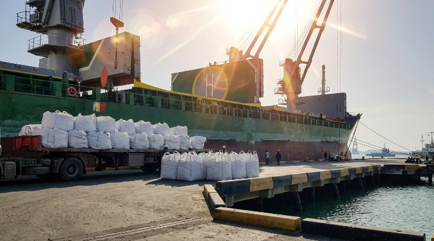
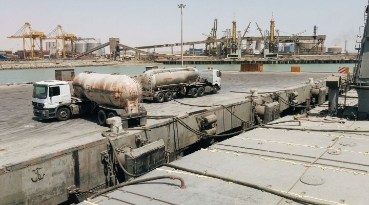
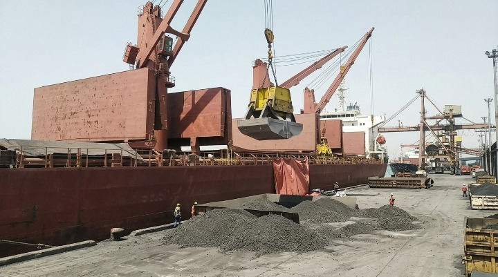
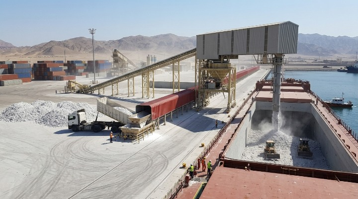

# Our Shipments & Operations

This section highlights our operational capacity and commitment to timely, reliable supply chain management.

 

<!-- پروژه سومالی -->

  
  

    Export Excellence
    <h2 style="color: #0d1b2a; margin: 15px 0;">Bagged Cement Export: Somalia Market</h2>
    

      Successfully managed the export of 10,000 MT of Type 2 Cement. We utilized a specialized packaging strategy, loading 50kg bags into 1.5-ton Jumbo bags, ensuring maximum cargo protection during maritime transport. This operation demonstrated our operational efficiency, maintaining a consistent loading rate of 3,000 MT per day.
    

    

      

10,000 MT

Total Volume

      

3,000 MT/day

Loading Rate

      

Somalia

Destination

    

  

<!-- پروژه کویت -->

  
  

    Strategic Operation
    <h2 style="color: #0d1b2a; margin: 15px 0;">Large-Scale Bulk Cement: Kuwait Market</h2>
    

      Successfully fulfilled a 30,000 MT shipment of Type 1 Bulk Cement for the Kuwaiti construction sector. Our operational focus centered on maintaining an optimized loading rate of 5,000 MT per 24 hours, ensuring critical project timelines were met with precision and minimizing vessel turnaround time at the port.
    

    

      

30,000 MT

Total Volume

      

5,000 MT/24h

Loading Rate

      

Kuwait

Destination

    

  

<!-- پروژه بنگلادش -->

  
  

    Success Story
    <h2 style="color: #0d1b2a; margin: 15px 0;">Bulk Clinker Export: Bangladesh Market</h2>
    

      Successfully managed the maritime export of 45,000 MT of Type 5 Clinker. This operation demonstrated our ability to coordinate high-volume logistics with extreme precision, achieving vessel turnaround in under 5 days.
    

    

      

45,000 MT

Volume

      

4.5 Days

Loading Time

      

Bulk

Carrier Type

    

  

<!-- پروژه سنگ گچ -->

  
  

    Operational Milestone
    <h2 style="color: #0d1b2a; margin: 15px 0;">Industrial Gypsum Export: China Market</h2>
    

      Managing a large-scale export contract of 47,000 MT of Gypsum Rock destined for the Chinese market. This operation highlights our heavy-duty logistics capability, achieving a consistent daily loading rate of 8,000 MT. We prioritize high-throughput supply chain efficiency to meet strict industrial timelines and reduce port costs.
    

    

      

47,000 MT

Total Volume

      

8,000 MT/day

Loading Rate

      

China

Destination

    

  

  <a href="/05_contact.html" style="background: #0d1b2a; color: #fff; padding: 12px 25px; text-decoration: none; border-radius: 4px; font-weight: bold;">Request a Consultation</a>

