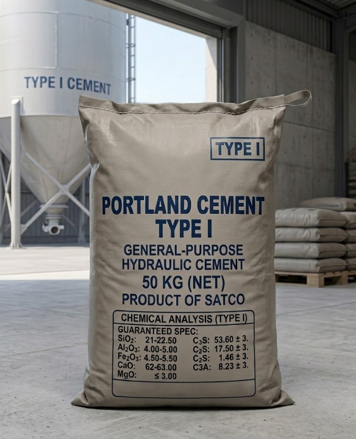

  <h1 style="color: #1a252f; border-bottom: 2px solid #cc7a00; padding-bottom: 10px;">Portland Cement Type 1: The Foundation of Modern Construction</h1>
  
  
Portland Cement Type 1 is the industry standard for general-purpose construction. It is a high-quality hydraulic cement produced by grinding clinker with a controlled amount of gypsum. Known for its versatility, it provides a consistent balance of strength and setting time, making it the most reliable choice for everyday building requirements.

  <h3 style="color: #1a252f;">Key Advantages</h3>
  <ul>
    <li><strong>High Versatility:</strong> Suitable for a wide range of concrete structures.</li>
    <li><strong>Consistent Strength:</strong> Provides predictable performance and structural integrity.</li>
    <li><strong>Workability:</strong> Offers excellent handling characteristics during mixing, placing, and finishing.</li>
    <li><strong>Cost-Effective:</strong> The most economical solution for general building projects.</li>
  </ul>

  <h3 style="color: #1a252f;">Primary Applications</h3>
  <ul>
    <li><strong>Residential & Commercial Buildings:</strong> Used for foundations, columns, beams, and slabs.</li>
    <li><strong>Infrastructure Projects:</strong> Ideal for bridges, tunnels, and highways where high-sulfate resistance is not a primary constraint.</li>
    <li><strong>Pavement & Walkways:</strong> Perfect for sidewalks, driveways, and parking areas.</li>
    <li><strong>Precast Concrete:</strong> Widely used in the manufacturing of concrete blocks, pipes, and architectural panels.</li>
  </ul>

  <h2 style="color: #cc7a00; margin-top: 30px;">Packaging & Supply Options</h2>
  
At SATCO, we provide flexible packaging solutions designed to meet the logistical requirements of any construction site or export destination, ensuring product integrity during transport.

  <ul>
    <li><strong>Bulk (Silo-loaded):</strong> Ideal for large-scale infrastructure projects and ready-mix concrete plants.</li>
    <li><strong>50 kg PP Bags:</strong> The standard choice for manual handling and smaller construction sites, offering excellent moisture resistance and durability.</li>
    <li><strong>1.5-ton Jumbo Bags (Bulk Cement):</strong> A secure and efficient way to transport bulk cement for medium-to-large projects, minimizing dust and handling loss.</li>
    <li><strong>1.5-ton Jumbo Bags (Packaged 50 kg Bags):</strong> Our specialized export solution, containing 30 units of 50 kg PP bags. This configuration maximizes space in shipping containers and provides superior protection during long-distance maritime transit.</li>
  </ul>

  <h2 style="color: #cc7a00; margin-top: 30px;">Comprehensive Product Analysis</h2>
  

  

    

      <h3 style="color: #1a252f;">Product Packaging</h3>
      
    

    

      <h3 style="color: #1a252f;">Loading Operation</h3>
      
    

  

  <h3 style="color: #1a252f; margin-top: 40px;">Loading & Export Video</h3>
  

    <iframe style="position: absolute; top: 0; left: 0; width: 100%; height: 100%;" src="https://www.youtube.com/embed/S2p0sL5-72I" frameborder="0" allowfullscreen></iframe>
  

